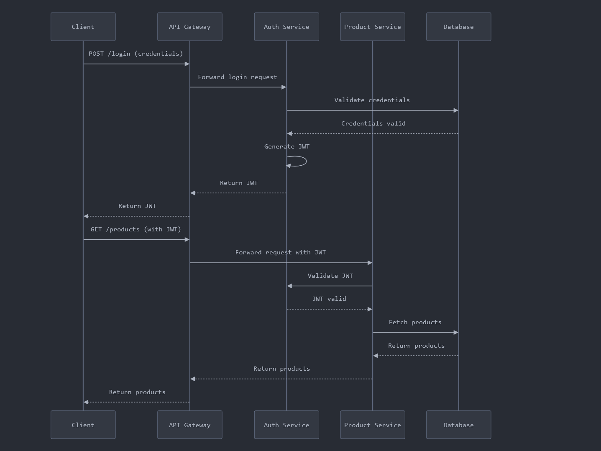

# Authentication and Authorization Microservice

Note: This project is currently a work in progress and may contain bugs.

This microservice is designed for user authentication and authorization using Node.js, JWT (JSON Web Tokens), and MongoDB. It supports access and refresh tokens, as well as token rotation to enhance security.

## Features

- **User Registration**: Allows users to register with their credentials.
- **User Login**: Enables users to log in and receive access and refresh tokens.
- **Access Tokens**: Short-lived tokens for authorizing requests to protected resources.
- **Refresh Tokens**: Longer-lived tokens used to obtain new access tokens without re-authentication.
- **Token Rotation**: Automatically invalidates old refresh tokens when a new one is issued, enhancing security.
- **Centralized Token Validation**: An endpoint that allows other services to validate access tokens issued by this microservice.

### Installation

1. Clone the repository:
   ```bash
   git clone https://github.com/suryo811/auth_service
   cd auth-service
   ```
2. Install dependencies:
   ```bash
   npm install
   ```
3. Set up your environment variables using .env.sample file

4. To start the server, run:
   ```bash
   npm run dev
   ```

## API Endpoints

#### Register a new user

- **POST** `/api/v1/auth/register`
- **Body**:

  ```json
  {
    "email": "string",
    "password": "string"
  }
  ```

#### Login

- **POST** `/api/v1/auth/login`
- **Body**:
  ```json
  {
    "email": "string",
    "password": "string"
  }
  ```
- **Response: 200 OK**

  ```json
  {
    "email": "string",
    "accessToken": "string",
    "refreshToken": "string"
  }
  ```

#### Validate Token

- **POST** `/api/v1/auth/validate-token`
- **HEADERS: Authorization: Bearer {token}**

- **Response: 200 OK**

  ```json
  {
    "valid": true,
    "data": {
      "userId": "string",
      "role": "string"
    }
  }
  ```

#### Refresh Token

- **POST** `/api/v1/auth/refresh-token`
- **HEADERS: Authorization: Bearer {token}**

- **Response: 200 OK**
  ```json
  {
    "msg": "access token refreshed successfully",
    "accessToken": "string",
    "refreshToken": "string"
  }
  ```

## Sequence Diagram

The following sequence diagram demonstrates the process of authentication, centralized JWT validation with an example product service.



## Contributing

Contributions are welcome! Please feel free to submit a pull request or open an issue to discuss improvements.
